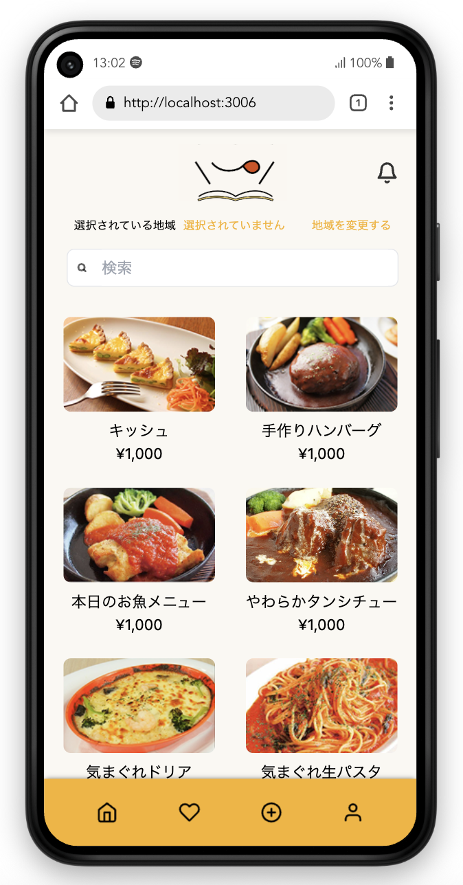
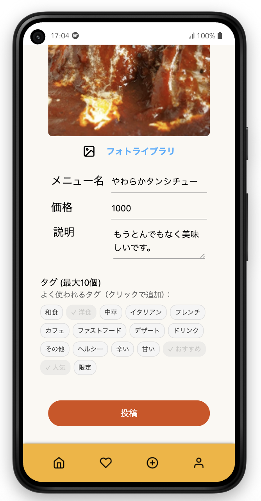
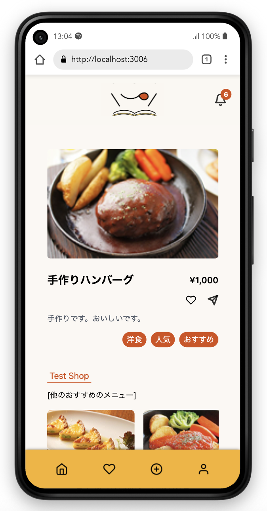
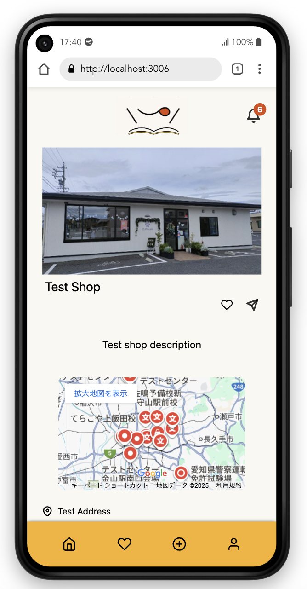
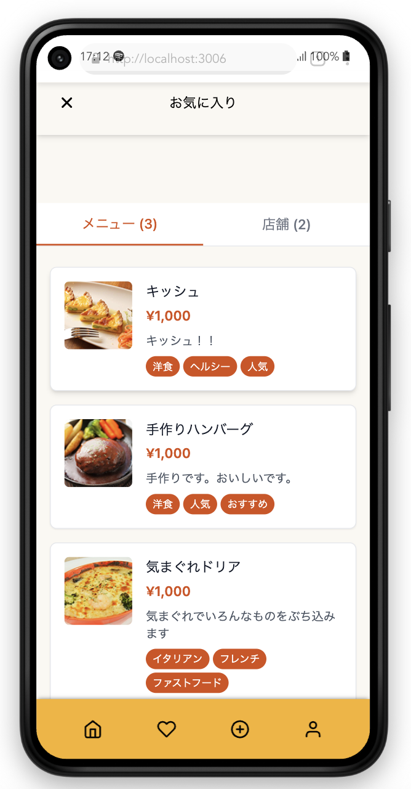
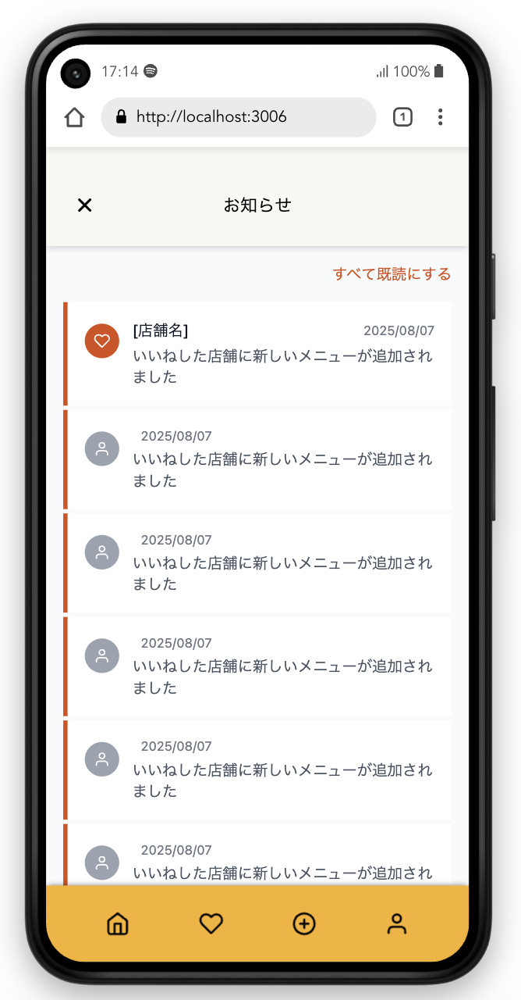
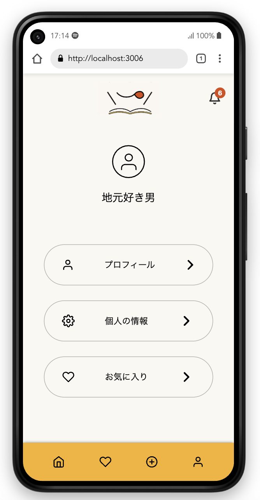

## アプリケーション概要
KADOKAWAドワンゴ情報工科学院・学内イベントTech Jamにて制作を進めました。

地元飲食店をその地域のユーザーが **"メニューから"** 知ってもらえるようになるためのアプリになります。

 

## サービスへの想い

地元でよく見るけど行ったことの無いお店、雰囲気的に少し敷居が高そうなお店など、飲食店の「外側」からではなかなかお店本来の魅力が伝わらないことがあります。

そこでメニューや雰囲気、こだわりや店主の方など、お店の<b>「内側」</b>から知ってもらうことによってより多くのお客さんに足を運んでもらうようにする。

まずはお店のメニューを入り口にして、そこからお店のことをさらに知ってもらおう、私たちはそのように考えて制作を進めました。

 

## チームメンバー
**プロダクトマネージャー**
- 山本淳平

**バックエンドエンジニア**
- 泉春花
- 若林真央
- 山本淳平

**フロントエンドエンジニア**
- 山本淳平

**デザイナー**
- 近藤陽花
- 佐々木杏羽
- 中元響介

 

## 技術スタック
<table>
  <tr>
    <th>
      フロントエンド
    </th>
    <td>
      

        
        
        
        
      

    </td>
  </tr>
  <tr>
    <th>
      バックエンド
    </th>
    <td>
      

        
        
        
      

    </td>
  </tr>
  <tr>
    <th>
      デザインツール
    </th>
    <td>
      

        
        
      

    </td>
  </tr>
  <tr>
    <th>
      開発ツール
    </th>
    <td>
      

        
        
        
      

    </td>
  </tr>
</table>

 

## アプリの機能
<table>
  <tr>
    <th>
      メニュー一覧
    </th>
    <th>
      メニュー投稿
    </th>
  </tr>
  <tr>
    <td>
      
    </td>
    <td>
      
    </td>
  </tr>
  <tr>
    <th>
      メニュー詳細
    </th>
    <th>
      店舗詳細
    </th>
  </tr>
  <tr>
    <td>
      
    </td>
    <td>
      
    </td>
  </tr>
  <tr>
    <th>
      お気に入り
    </th>
    <th>
      お知らせ
    </th>
  </tr>
  <tr>
    <td>
      
    </td>
    <td>
      
    </td>
  </tr>
  <tr>
    <th>
      プロフィール（一般ユーザー）
    </th>
  </tr>
  <tr>
    <td>
      
    </td>
  </tr>
</table>

 

## 今後の展望
今後追加していきたい機能としては
- メニューの価格帯でソート
- 同じ店舗のおすすめだけでなく、同じジャンルでのおすすめ表示
- アレルギーでのメニュー検索
- 座席状況が確認できる予約機能

などがあります！
